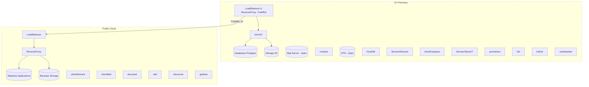

[Editor](https://mermaid.live)

```mermaid
graph TD
    %% On-Premises Cluster
    subgraph op[On Premises]
        style op stroke-dasharray: 5 5
        disk1[(Databases Postgres)]
        disk2[(Storage Employe)]
        disk2[(Storage S3)]
        server1[LoadBalancer & ReverseProxy -Traeffick]

        mail[(Mail Server - Open)]
        coredns

        vpn[(VPN - Open)]
        KaniDM
        ServeurElement

        driveEmployes

        ServeurWazuh?

        promehtus
        loki

        harbor

        vaultwarden

        %% Internal connections
        server1 --> server2
        server2 --> disk1
        server2 --> disk2
    end

    %% Public Cloud Cluster
    subgraph pc[Public Cloud]
        style pc stroke-dasharray: 5 5
        db2[(Stateless Applications)]
        disk3[(Backups Storage)]
        server3[LoadBalancer]
        server4[ReverseProxy]


        clientElement
        clientMail

        docuseal
        wiki
        discourse

        grafana

        %% Internal connections
        server3 --> server4
        server4 --> db2
        server4 --> disk3
    end

    %% Connection between On-Premises and Cloud
    server1 -->|TUNNEL IP| server3
```
