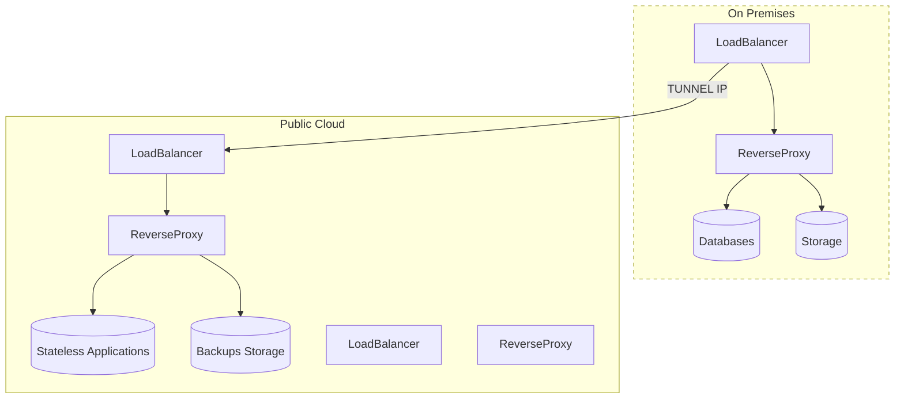

[Editor](https://mermaid.live)

```mermaid
graph TD
    %% On-Premises Cluster
    subgraph op[On Premises]
        style op stroke-dasharray: 5 5
        disk1[(Databases)]
        disk2[(Storage)]
        server1[LoadBalancer]
        server2[ReverseProxy]

        %% Internal connections
        server1 --> server2
        server2 --> disk1
        server2 --> disk2
    end

    %% Public Cloud Cluster
    subgraph cp[Public Cloud]
        style cp stroke-dasharray: 5 5
        db2[(Stateless Applications)]
        disk3[(Backups Storage)]
        server3[LoadBalancer]
        server4[ReverseProxy]

        %% Internal connections
        server3 --> server4
        server4 --> db2
        server4 --> disk3
    end

    %% Enterprise Network
    subgraph cp[Enterprise Network]
        style cp stroke-dasharray: 5 5
        server5[LoadBalancer]
        server6[ReverseProxy]
    end

    %% Connection between On-Premises and Cloud
    server1 -->|TUNNEL IP| server3

```
